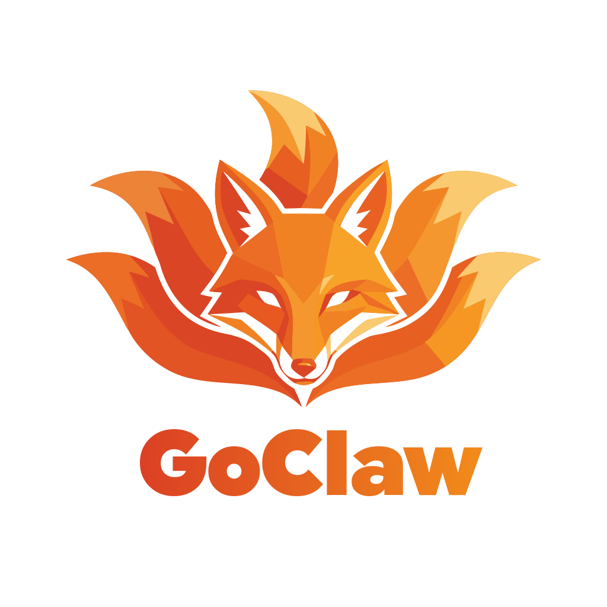
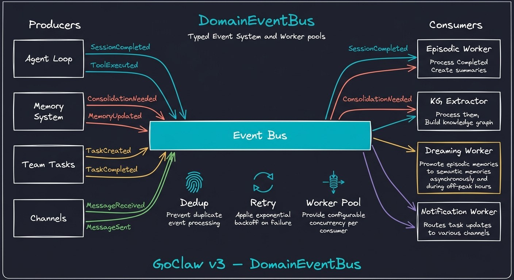

<p align="center">
  
</p>

<p align="center"><strong>Multi-Tenant AI Agent Platform</strong></p>

<p align="center">
Multi-agent AI gateway built in Go. 40+ LLM providers (API-key + OAuth subscriptions). 10 channels. Multi-tenant PostgreSQL.<br/>
Single binary. Production-tested. Agents that orchestrate — and create slides, videos, and art — for you.
</p>

<p align="center">
  <a href="https://github.com/qkhalk/goclaw/releases">Releases</a> •
  <a href="https://github.com/qkhalk/goclaw#quick-start">Quick Start</a>
</p>

<p align="center">
  <a href="https://go.dev/"></a>
  <a href="https://www.postgresql.org/"></a>
  <a href="https://www.docker.com/"></a>
  <a href="https://developer.mozilla.org/en-US/docs/Web/API/WebSocket"></a>
  <a href="https://opentelemetry.io/"></a>
  <a href="https://www.anthropic.com/"></a>
  <a href="https://openai.com/"></a>
  
</p>

## Features

- **8-Stage Agent Pipeline** — context → history → prompt → think → act → observe → memory → summarize. Pluggable stages, always-on execution
- **4-Mode Prompt System** — Full / Task / Minimal / None with section gating, cache boundary optimization, and per-session mode resolution
- **3-Tier Memory** — Working (conversation) → Episodic (session summaries) → Semantic (knowledge graph). Progressive loading L0/L1/L2
- **Knowledge Vault** — Document registry with [[wikilinks]], hybrid search (FTS + pgvector), filesystem sync
- **Creative Studio (Tools)** — PPTX Studio at `/tools/pptx` (in-browser slide render + real `.pptx` export, backed by a design-only `pptx-designer` agent with bundled deck-design/visual-style skills), video editor (canvas/timeline/TTS, scene enter transitions, per-scene transform/filter), and a client-side watermark remover — no server round-trips needed
- **Video Pipeline** — Server-side storyboard rendering via a standalone ffmpeg worker binary (`cmd/videoworker`), `render_video` agent tool, HTTP API + WS events, render-job lifecycle with delete/preview ([deploy/README-video-worker.md](deploy/README-video-worker.md))
- **Cloud Accounts** — Connect your own accounts per user: Gmail + Google Drive (OAuth), OneDrive (BYO Azure app), more providers on the shared rclone engine. Drive-style web shell with file ops, multi-select, drag-drop upload, cross-account transfer + sync pairs, starred/recents/preview/share links, quota + mailbox views. Agents search/read/clean mail (no permanent delete, consent-gated unsubscribe) and browse/download Drive files. Shared accounts with per-scope bindings
- **Agent Teams & Orchestration** — Shared task boards, inter-agent delegation (sync/async), 3 orchestration modes (auto/explicit/manual)
- **Self-Evolution** — Metrics → suggestions → auto-adapt with guardrails. Agents refine their own communication style
- **Multi-Tenant PostgreSQL** — Per-user workspaces, per-user context files, encrypted API keys (AES-256-GCM), RBAC, isolated sessions
- **Skill Library** — 110 repo-native skills (research, scraping, OCR, data-analysis, media-processing, copywriting, databases, ...) with BM25 + semantic hybrid search, plus skills bundled into the binary
- **40+ LLM Providers** — Anthropic (native HTTP+SSE with prompt caching), OpenAI, OpenRouter, Groq, DeepSeek, Gemini, Mistral, xAI, MiniMax, DashScope, Moonshot/Kimi, Together, Fireworks, Cerebras, NVIDIA NIM, StepFun, Venice, Baseten, Chutes, Hugging Face Router, Synthetic, Kilo Code, OpenCode Zen, Claude CLI, Codex, ACP, Vertex AI, Parallel web search, any OpenAI-compatible endpoint — plus OAuth subscriptions: ChatGPT, Claude Pro/Max, GitHub Copilot
- **10 Channels** — Telegram (inline pickers, paged skills, localized commands), Discord, Slack, Facebook/Messenger, Zalo OA, Zalo Personal, Feishu/Lark, WhatsApp, Bitrix24 (imbot v2), Pancake
- **Chat UX** — Per-run permission modes (plan / full access / write approval / always ask), interactive `ask_options` questions in web + Telegram, workspace path autocomplete
- **Production Security** — 5-layer permission system, rate limiting, prompt injection detection, SSRF protection, AES-256-GCM encryption
- **Single Binary** — ~25 MB static Go binary, no Node.js runtime, <1s startup, runs on a $5 VPS
- **Observability** — Built-in LLM call tracing with spans and prompt cache metrics, provider routing graph + recent-requests view, optional OpenTelemetry OTLP export
- **Localized** — Web UI and channel messages in 5 locales: English, Vietnamese, Chinese, Korean, Russian

## Reliability Layer

**`internal/reliability/`** — unified reliability infrastructure with unit tests:

| Module | File | Description |
|--------|------|-------------|
| Error taxonomy | `errors.go` | Canonical `ErrorCode` (`provider.*`, `model.*`, `runtime.*`, `tool.*`) with retryability + severity. `ReliabilityError`, `ClassifyError` (HTTP status/body → code), `IsRetryable` |
| Circuit breaker | `circuitbreaker.go` | State machine per provider:model (Healthy → Degraded → Open → HalfOpen), consecutive-failure counting, cooldown, `ProbeTimeout` |
| Health registry | `health.go` | Per-key runtime reliability scoring (success ratio − stall/tool-error penalties) |
| Rate-limit coordinator | `ratelimit.go` | Single-flight cooldown against retry storms; fail-closed `ErrMaxPendingWaiters` when waiter cap exceeded; stale waiter cannot delete newer cooldown |
| Metrics | `metrics.go` | `atomic` counters + `Snapshot`, global swap-safe `Sink`, `Flush` drain per-counter |

## Releases

Releases are created manually via GitHub Actions (`release-fork.yaml`) — builds binaries for 5 platforms (linux/amd64 + arm64, darwin/amd64 + arm64, windows/amd64) with embedded web UI, Docker images (`ghcr.io/qkhalk/goclaw:{tag}` + `-full`, alias `:fork`), and GitHub Releases.

| Tag | Type | Changes | Docker |
|-----|------|---------|--------|
| `v4.5.0` | stable | **v4 line — creative tools + cloud drive:** video creation pipeline (storyboard job store with dual-DB migrations, standalone ffmpeg `videoworker` binary, `render_video` tool + HTTP API + WS events), video editor with canvas/timeline/TTS, scene transitions and per-scene transform/filter, client-side watermark remover; **Clouds redesign** — drive-style shell, file ops UI, cross-account transfer + sync pairs, starred/recents/preview/share links, OneDrive provider, shared accounts + per-scope bindings, zero-config embedded OAuth clients; **OAuth subscriptions** Claude Pro/Max + GitHub Copilot; **+13 API-key providers** (NVIDIA NIM, StepFun, Venice, Baseten, Chutes, HF Router, Moonshot, Together, Fireworks, Cerebras, Synthetic, Kilo Code, OpenCode Zen); Bitrix24 imbot v2 migration; web `ask_options`, per-run permission modes, 9router-style usage views | `ghcr.io/qkhalk/goclaw:v4.5.0`, `:v4.5.0-full` |
| `v3.16.1` | stable | **Phase B — Resource leak & retry hardening:** scheduler session eviction, watchdog age-based eviction, timeline delta coalescing, retry admission hardening (`RetryDoFor`, fail-closed waiters). **Phase A:** security P0 fixes + slash command palette. Reliability layer; `/gc:` command system. **Parallel web search provider** | `ghcr.io/qkhalk/goclaw:v3.16.1`, `:v3.16.1-full` |

> **In development:** PPTX Studio (in-browser slide deck editor with `.pptx` export), a design-only `pptx-designer` agent with bundled deck-design/visual-style skills, and an expansion to 110 repo-native skills. See [CHANGELOG.md](CHANGELOG.md) for details.

## Desktop Edition (GoClaw Lite)

A native desktop app for local AI agents — no Docker, no PostgreSQL, no infrastructure.

**macOS:**
```bash
curl -fsSL https://raw.githubusercontent.com/qkhalk/goclaw/dev/scripts/install-lite.sh | bash
```

**Windows (PowerShell):**
```powershell
irm https://raw.githubusercontent.com/qkhalk/goclaw/dev/scripts/install-lite.ps1 | iex
```

### What's Included
- Single native app (Wails v2 + React), ~30 MB
- SQLite database (zero setup)
- Chat with agents (streaming, tools, media, file attachments)
- Agent management (max 5), provider config, MCP servers, skills, cron
- Team tasks with Kanban board and real-time updates
- Auto-update from GitHub Releases

### Lite vs Standard

| Feature | Lite (Desktop) | Standard (Server) |
|---------|---------------|-------------------|
| Agents | Max 5 | Unlimited |
| Teams | Max 1 (5 members) | Unlimited |
| Database | SQLite (local) | PostgreSQL |
| Memory | FTS5 text search | pgvector semantic |
| Channels | — | Telegram, Discord, Slack, Facebook, Zalo, Feishu/Lark, WhatsApp, Bitrix24, Pancake |
| Knowledge Graph | — | Full |
| RBAC / Multi-tenant | — | Full |
| Auto-update | GitHub Releases | Docker / binary |

### Building from Source
```bash
# Prerequisites: Go 1.26+, pnpm, Wails CLI (go install github.com/wailsapp/wails/v2/cmd/wails@latest)
make desktop-build                    # Build .app (macOS) or .exe (Windows)
make desktop-dmg VERSION=0.1.0        # Create .dmg installer (macOS only)
make desktop-dev                      # Dev mode with hot reload
```

### Desktop Releases
Desktop uses independent versioning with `lite-v*` tags:
```bash
git tag lite-v0.1.0 && git push origin lite-v0.1.0
# → GitHub Actions builds macOS (.dmg + .tar.gz) + Windows (.zip)
# → Creates GitHub Release with all assets
```

## Architecture

<p align="center">
  
</p>

<p align="center">
  
</p>

<p align="center">
  
</p>

<p align="center">
  
</p>

## Quick Start

**Prerequisites:** Go 1.26+, PostgreSQL 18 with pgvector, Docker (optional)

### Install (one-liner)

```bash
# macOS / Linux / WSL
curl -fsSL https://github.com/qkhalk/goclaw/raw/dev/scripts/install.sh | bash
```

```powershell
# Windows (PowerShell)
powershell -c "irm https://github.com/qkhalk/goclaw/raw/dev/scripts/install.ps1 | iex"
```

Sau khi cài: `goclaw onboard` (wizard, tự chạy migrations) rồi `goclaw` để khởi động gateway. Web dashboard tại `http://localhost:18790`.

### From Source

```bash
git clone -b dev https://github.com/qkhalk/goclaw.git && cd goclaw
make build
./goclaw onboard        # Interactive setup wizard
source .env.local && ./goclaw
```

### With Docker

```bash
# Generate .env with auto-generated secrets
chmod +x prepare-env.sh && ./prepare-env.sh

# Add at least one GOCLAW_*_API_KEY to .env, then:
make up

# If Postgres fails to start ("port 5432 already allocated"), set another host
# port in .env, e.g. POSTGRES_PORT=5433 (see .env.example).

# Web Dashboard at http://localhost:18790 (built-in)
# Health check: curl http://localhost:18790/health

# Optional: separate nginx for custom SSL/reverse proxy
# make up WITH_WEB_NGINX=1  → Dashboard at http://localhost:3000
```

`make up` creates a Docker network, embeds the correct version from git tags, builds and starts all services, and runs database migrations automatically.

**Common commands:**

```bash
make up                # Start all services (build + migrate)
make down              # Stop all services
make logs              # Tail logs (goclaw service)
make reset             # Wipe volumes and rebuild from scratch
```

**Operator CLI:**

The main `goclaw` binary can also inspect local or remote gateways:

```bash
goclaw traces list --status error
goclaw traces get <trace-id> -o json
goclaw --server https://goclaw.example.com --token "$GOCLAW_GATEWAY_TOKEN" traces follow --session <session-key>
```

**Optional services** — enable with `WITH_*` flags:

| Flag | Service | What it does |
|------|---------|-------------|
| `WITH_BROWSER=1` | Headless Chrome | Enables `browser` tool for web scraping, screenshots, automation |
| `WITH_OTEL=1` | Jaeger | OpenTelemetry tracing UI for debugging LLM calls and latency |
| `WITH_SANDBOX=1` | Docker sandbox | Isolated container for running untrusted code from agents |
| `WITH_TAILSCALE=1` | Tailscale | Expose gateway over Tailscale private network |
| `WITH_REDIS=1` | Redis | Redis-backed caching layer |

Flags can be combined and work with all commands:

```bash
# Start with browser automation and tracing
make up WITH_BROWSER=1 WITH_OTEL=1

# Stop everything including optional services
make down WITH_BROWSER=1 WITH_OTEL=1
```

When `GOCLAW_*_API_KEY` environment variables are set, the gateway auto-onboards without interactive prompts — detects provider, runs migrations, and seeds default data.

> **Docker image variants:**
> | Image | Description |
> |-------|-------------|
> | `ghcr.io/qkhalk/goclaw:v4.5.0` | Backend + embedded web UI + Python (**recommended**) |
> | `ghcr.io/qkhalk/goclaw:v4.5.0-base` | Backend API-only, no web UI, no runtimes |
> | `ghcr.io/qkhalk/goclaw:v4.5.0-full` | All runtimes + skill dependencies pre-installed |
> | `ghcr.io/qkhalk/goclaw:latest` | Alias for the latest stable tag |
>
> For custom builds (Tailscale, Redis): `docker build --build-arg ENABLE_TSNET=true ...`
> See the [Deployment Guide](https://docs.goclaw.sh/#deploy-docker-compose) for details.

## Updating

### Docker
```bash
docker compose pull && docker compose up -d
```

### Binary (with embedded web UI)
```bash
goclaw update --apply    # Downloads, verifies SHA256, swaps binary, restarts
```

### Web Dashboard
Open **About** dialog → click **Update Now** (admin only). The update includes both backend and web dashboard when using the default `latest` image.

## Multi-Agent Orchestration

<p align="center">
  
</p>

Each agent runs with its own identity, tools, LLM provider, and context files.
Agent Links define outbound, inbound, or bidirectional permission edges.
Delegation can run synchronously or asynchronously and exchanges files through
an isolated delegation workspace; validated outputs are published back under
the caller's `.delegations/<delegation-id>/` directory.

> Details: [Agent Teams docs](https://docs.goclaw.sh/#teams-what-are-teams)

## Knowledge Vault

<p align="center">
  
</p>

Document registry with `[[wikilinks]]` for bidirectional linking. Hybrid search combines full-text (BM25) and semantic (pgvector) for precise retrieval. Filesystem sync keeps vault in sync with on-disk files.

## Cloud Accounts

Connect your own cloud accounts per user and let agents work with them as tools — a differentiator among self-hosted agent gateways. The Cloud page has its own sidebar group with a storage-provider catalog: Google Drive (available now), OneDrive (bring-your-own Azure app), with more providers coming on the shared rclone engine.

- **Zero-config connect or BYO** — installs ship embedded shared OAuth clients, so most users just click Connect; a paste-back BYO flow (PKCE + HMAC-signed state) remains for those who want each install to register its own GCP/Azure app. See [docs/30-cloud-accounts.md](docs/30-cloud-accounts.md).
- **Multi-account, per-user isolation** — every user connects their own accounts; tokens are AES-256-GCM encrypted at rest and scoped by tenant + user. Shared accounts with per-scope bindings let admins expose one account to selected agents/users.
- **Drive-style web shell** — left rail with per-provider account groups, file menus + multi-select, drag-drop upload, video/audio/image preview, starred + recents, share links, shortcuts, quota bars, and cross-account transfer with sync pairs.
- **Mail tools** — `mail_search` (Gmail search syntax), `mail_read`, `mail_archive` (archive/trash/label; permanent delete does not exist by construction), and `mail_unsubscribe` (RFC 8058 — analyze first, executes only with explicit user consent).
- **Drive tools** — `cloud_ls` / `cloud_read` / `cloud_fetch` / `cloud_about` backed by a supervised rclone daemon on loopback (bundled in every Docker variant); fetched files land in the calling session's workspace.
- **mail-digest skill** — schedule a daily digest by cron: 24h mail grouped by sender with newsletter candidates proposed for unsubscription (never auto-executed).

## Self-Evolution

<p align="center">
  
</p>

Agents improve themselves through a 3-stage guardrailed pipeline: metrics collection → suggestion analysis → auto-adaptation. Can refine communication style and domain expertise (CAPABILITIES.md) — but never change identity, name, or core purpose.

## Provider Adapters

<p align="center">
  
</p>

40+ LLM providers — API keys, OAuth subscriptions (ChatGPT, Claude Pro/Max, GitHub Copilot) — unified through a single adapter interface. Capability-based routing, encrypted API keys (AES-256-GCM), extended thinking support per-provider, and prompt caching for Anthropic + OpenAI.

## Event-Driven Architecture

<p align="center">
  
</p>

Typed domain events power the consolidation pipeline — session summaries, knowledge graph extraction, and dreaming promotion all run asynchronously via worker pools with dedup and retry.

## Built-in Tools

30+ tools across 8 categories:

| Category | Tools | Description |
|----------|-------|-------------|
| **Filesystem** | `read_file`, `write_file`, `edit_file`, `list_files`, `search`, `glob` | File operations with virtual FS routing |
| **Runtime** | `exec`, `credentialed_exec`, `browser` | Shell commands (approval workflow), credentialed runs with ephemeral audited secrets (git/psql adapters), browser automation |
| **Web** | `web_search`, `web_fetch`, `parallel_search` | Search (Brave, DuckDuckGo, Parallel) + content extraction |
| **Memory** | `memory_search`, `memory_get`, `knowledge_graph_search` | 3-tier memory + KG traversal |
| **Media** | `create_image`, `create_audio`, `create_video`, `read_*`, `tts` | Generation + analysis (image/video multi-provider: Gemini, BytePlus, MiniMax, ...) |
| **Video** | `render_video` | Storyboard → ffmpeg `videoworker` render jobs with WS progress events |
| **Cloud** | `cloud_ls`, `cloud_read`, `cloud_fetch`, `cloud_about`, `mail_search`, `mail_read`, `mail_archive`, `mail_unsubscribe` | Drive/Gmail operations via rclone + Google APIs (consent-gated) |
| **Skills** | `skill_search`, `use_skill`, `skill_manage` | BM25 + semantic hybrid search |
| **Teams** | `team_tasks`, `spawn`, `delegate`, `message` | Task board + orchestration + messaging |
| **Interaction** | `ask_options` | Clarifying questions with 1–4 option buttons (web chat + Telegram) |
| **Automation** | `cron`, `heartbeat`, `sessions_*` | Scheduling + session management |

> Full tool reference at [docs.goclaw.sh](https://docs.goclaw.sh/#custom-tools)

## Creative Tools (Studio)

The web UI ships a **Tools** section with creative apps that run where they fit best — heavy rendering on the server, interactive editing in the browser:

- **PPTX Studio** (`/tools/pptx`) — build slide decks by chatting with `pptx-designer`, a design-only agent on a minimal tool allowlist. Slides render live in the browser and export as real `.pptx` files. Backed by two skills bundled into the binary: `pptx-deck-design` and `pptx-visual-style`.
- **Video Editor** (`/tools/video`) — canvas + timeline editing with TTS voiceover, Remotion-style scene enter transitions, per-scene transform/filter, and render-job management. Interactive edits run client-side; final renders go through the server-side pipeline.
- **Watermark Remover** (`/tools/watermark`) — fully client-side image and video watermark removal using a calibrated inverse-alpha unblend (the `gemini-watermark-remover` engine) — video clips are restored frame-by-frame in realtime while recording, so nothing leaves the browser.

Server-side video rendering runs on a standalone ffmpeg worker binary (`cmd/videoworker`) — independent deployment, systemd unit, and scaling notes in [deploy/README-video-worker.md](deploy/README-video-worker.md). Agents trigger it directly with the `render_video` tool.

## Webhook API

Trigger agents or send channel messages from external systems without the gateway token.

```bash
# Bearer auth — sync LLM call
curl -X POST https://example.com/v1/webhooks/llm \
  -H "Authorization: Bearer wh_..." \
  -H "Content-Type: application/json" \
  -d '{"input":"Summarize today metrics","mode":"sync"}'

# HMAC auth — sign with hmac_signing_key from create response
TS=$(date +%s); BODY='{"input":"hi","mode":"sync"}'
SIG=$(echo -n "${TS}.${BODY}" | openssl dgst -sha256 -mac HMAC \
      -macopt "hexkey:${WEBHOOK_HMAC_KEY}" | awk '{print $2}')
curl -X POST https://example.com/v1/webhooks/llm \
  -H "Content-Type: application/json" \
  -H "X-Webhook-Id: ${WEBHOOK_ID}" \
  -H "X-GoClaw-Signature: t=${TS},v1=${SIG}" \
  -d "$BODY"
```

See **[docs/webhooks.md](docs/webhooks.md)** for the full reference: auth, async callbacks, retry schedule, HMAC examples, channel matrix.

## Documentation

Full documentation at **[docs.goclaw.sh](https://docs.goclaw.sh)**

| Section | Topics |
|---------|--------|
| [Getting Started](https://docs.goclaw.sh/#what-is-goclaw) | Installation, Quick Start, Configuration, Web Dashboard Tour |
| [Core Concepts](https://docs.goclaw.sh/#how-goclaw-works) | Agent Loop, Sessions, Tools, Memory, Multi-Tenancy |
| [Agents](https://docs.goclaw.sh/#creating-agents) | Creating Agents, Context Files, Personality, Sharing & Access |
| [Providers](https://docs.goclaw.sh/#providers-overview) | Anthropic, OpenAI, OpenRouter, Gemini, DeepSeek, OAuth subscriptions, and 35+ more |
| [Channels](https://docs.goclaw.sh/#channels-overview) | Telegram, Discord, Slack, Facebook, Feishu, Zalo, WhatsApp, Bitrix24, Pancake, WebSocket |
| [Agent Teams](https://docs.goclaw.sh/#teams-what-are-teams) | Teams, Task Board, Messaging, Delegation & Handoff |
| [Advanced](https://docs.goclaw.sh/#custom-tools) | Custom Tools, MCP, Skills, Cron, Sandbox, Hooks, RBAC |
| [Deployment](https://docs.goclaw.sh/#deploy-docker-compose) | Docker Compose, Database, Security, Observability, Tailscale |
| [Reference](https://docs.goclaw.sh/#cli-commands) | CLI Commands, REST API, WebSocket Protocol, Environment Variables |

## Testing

```bash
go test ./...                                    # Unit tests
go test -v ./tests/integration/ -timeout 120s    # Integration tests (requires running gateway)
```

## Project Status

See [CHANGELOG.md](CHANGELOG.md) for detailed feature status including what's been tested in production and what's still in progress.

## License

[CC BY-NC 4.0](LICENSE) — Creative Commons Attribution-NonCommercial 4.0 International

## Star History

<a href="https://www.star-history.com/?repos=qkhalk%2Fgoclaw&type=date&legend=top-left">
 <picture>
   <source media="(prefers-color-scheme: dark)" srcset="https://api.star-history.com/image?repos=qkhalk/goclaw&type=date&theme=dark&legend=top-left" />
   <source media="(prefers-color-scheme: light)" srcset="https://api.star-history.com/image?repos=qkhalk/goclaw&type=date&legend=top-left" />
   
 </picture>
</a>
