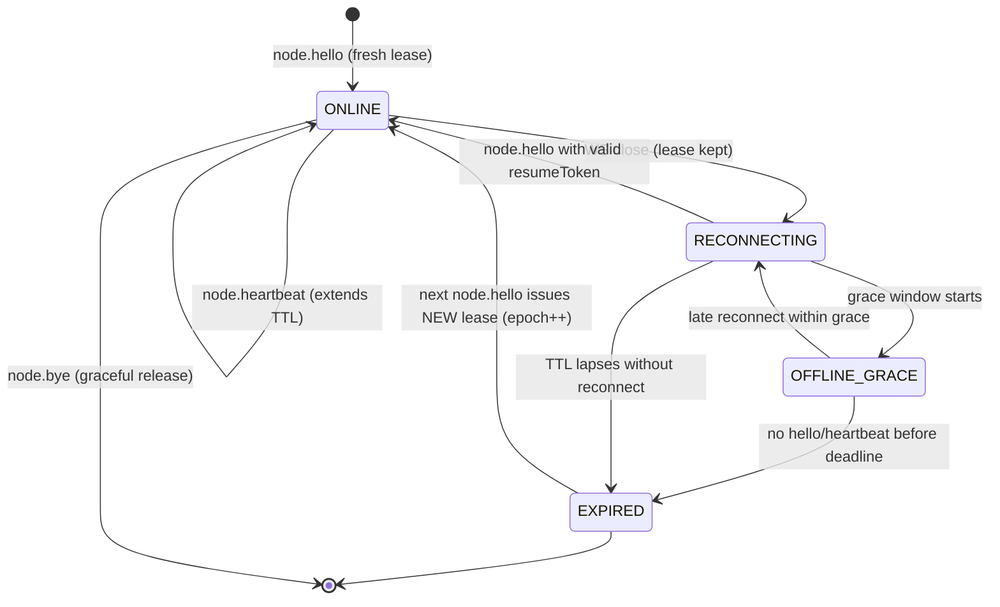

# Phase 1 — Node Lease Protocol

The node lease separates **node connectivity** from **authentication** and from the WebSocket connection itself. A dropped WebSocket must never mean "logout": the server marks the connection disconnected, keeps the node lease alive for a grace window, keeps agent sessions intact, and allows reconnect.

```
identity/authentication != websocket connection != node lease != agent session
```

---

## 1. Lease Record

One lease per `node_id` (unique). Stored in the `node_leases` table (PG migration `000109_node_leases`; SQLite schema v72).

| Field           | Type        | Notes                                             |
|-----------------|-------------|---------------------------------------------------|
| `nodeId`        | text        | Unique node identifier (client-generated)         |
| `clientId`      | text        | Browser/client instance that owns the node        |
| `userId`        | text        | Authenticated owner; lease is scoped to this user |
| `resumeToken`   | text unique | Opaque token used to resume after reconnect       |
| `issuedAt`      | timestamptz | Lease creation time                               |
| `lastSeenAt`    | timestamptz | Updated on heartbeat                              |
| `expiresAt`     | timestamptz | Now + TTL; extended by heartbeat                  |
| `sessionEpoch`  | int         | Bumped on fresh hello without a valid resume      |
| `status`        | text        | `online` / `reconnecting` / `offline_grace` / `expired` |

## 2. Timing

| Parameter          | Value                          |
|--------------------|--------------------------------|
| Heartbeat interval | 15 s (client-initiated)        |
| Lease TTL          | 60 s (server-side, refreshed on heartbeat) |
| Offline grace      | 2–5 min recommended for UI clients |

## 3. Methods

All three methods require an authenticated client (`client.authenticated`). The server always scopes the lease to the caller's `userID`; a client can only touch its own leases.

### 3.1 `node.hello`

First call on connect or reconnect. With a valid `resumeToken` the existing lease is resumed and events are replayed; without one, a new lease is issued (`sessionEpoch` bumped).

Request:

```json
{
  "type": "req",
  "id": "h1",
  "method": "node.hello",
  "params": {
    "nodeId": "web-node-a1b2",
    "clientId": "browser-tab-7f3e",
    "resumeToken": "rt_9c8d...",
    "lastSeenSeq": 1042
  }
}
```

Response (resumed, replay available):

```json
{
  "type": "res",
  "id": "h1",
  "ok": true,
  "payload": {
    "lease": {
      "nodeId": "web-node-a1b2",
      "expiresAt": "2026-08-23T12:01:00Z",
      "ttlSeconds": 60
    },
    "replayed": 17,
    "snapshotRequired": false
  }
}
```

Response (fresh lease, nothing to replay):

```json
{
  "type": "res",
  "id": "h1",
  "ok": true,
  "payload": {
    "lease": { "nodeId": "web-node-a1b2", "expiresAt": "...", "ttlSeconds": 60 },
    "replayed": 0,
    "snapshotRequired": false
  }
}
```

### 3.2 `node.heartbeat`

Sent every ~15 s while connected. Refreshes `lastSeenAt` and extends `expiresAt` by the lease TTL.

```json
{
  "type": "req",
  "id": "hb1",
  "method": "node.heartbeat",
  "params": { "nodeId": "web-node-a1b2" }
}
```

```json
{
  "type": "res",
  "id": "hb1",
  "ok": true,
  "payload": { "expiresAt": "2026-08-23T12:01:20Z", "ttlSeconds": 60 }
}
```

A heartbeat for an unknown/expired lease returns an error (`LEASE_EXPIRED`) — the client must re-run `node.hello`.

### 3.3 `node.bye`

Graceful release before intentional disconnect (tab close via `beforeunload`, explicit sign-out).

```json
{
  "type": "req",
  "id": "bye1",
  "method": "node.bye",
  "params": { "nodeId": "web-node-a1b2" }
}
```

```json
{ "type": "res", "id": "bye1", "ok": true, "payload": {} }
```

## 4. Lease State Machine



## 5. Reconnect Handshake

```
HELLO -> AUTH CHECK -> RESUME NODE LEASE -> RESUME SUBSCRIPTIONS
      -> REPLAY EVENTS after last_seen_seq -> SNAPSHOT FALLBACK if gap too large
```

**WS close does NOT invalidate the lease.** Only `node.bye` (graceful) or TTL expiry ends it.

## 6. Replay Semantics

Replay is served from the durable **run timeline journal** (`RunTimelineStore.ListRunTimelineItems AfterSeq`) — there is no second global event store.

- Event frames already carry an optional `seq` (monotonic per connection for non-run events).
- On `node.hello` with a valid `resumeToken`, events recorded in the run timeline with sequence numbers greater than `lastSeenSeq` are replayed to the client before normal traffic resumes.
- `replayed` reports how many events were resent.
- If the gap between `lastSeenSeq` and the oldest retained event is too large (events evicted), the server sets `snapshotRequired: true` and skips replay — the client must refetch current state (e.g. `run.timeline.get`, `sessions.list`) instead of relying on incremental deltas.
- A missing/unknown `resumeToken` yields a fresh lease; the client should also refresh state rather than expect replay.
